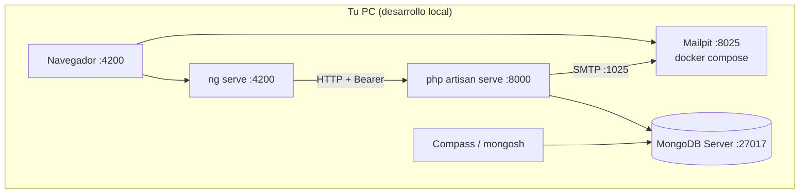
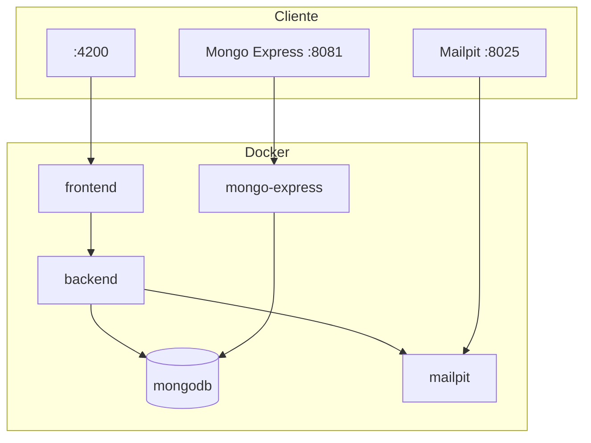
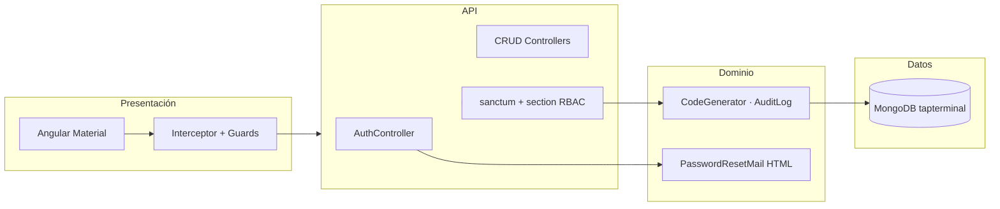
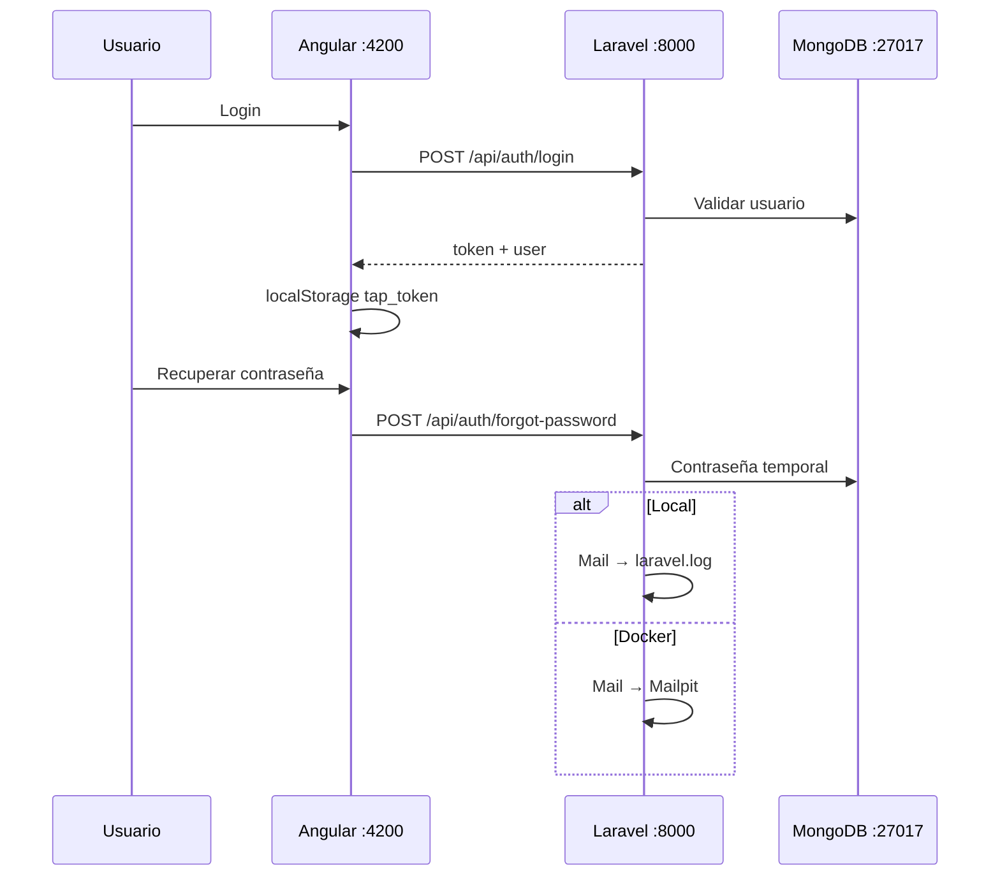
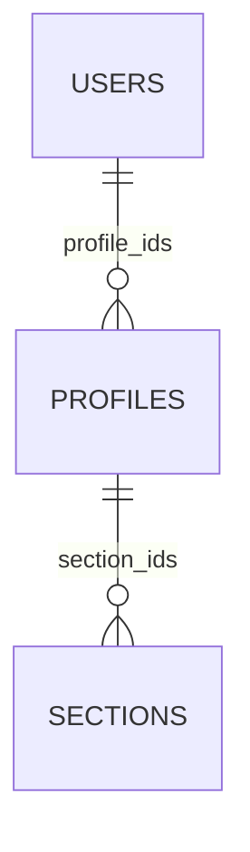

# Arquitectura — Tap Terminal

Documentación de la arquitectura del sistema full stack del examen de admisión (Área de Desarrollo).

## Modo de ejecución

| Modo | Uso | MongoDB | Correo |
|------|-----|---------|--------|
| **Local** (por defecto) | PHP + Node en el host + Mailpit (Docker) | `127.0.0.1:27017` | SMTP → `127.0.0.1:1025` (Mailpit) |
| **Docker** (opcional) | `docker compose up` | `mongodb:27017` (red Docker) / host `:27018` | SMTP → Mailpit `:8025` |

---

## Stack tecnológico

| Capa | Tecnología |
|------|------------|
| Frontend | Angular 19, TypeScript, Angular Material |
| API | Laravel 11, PHP 8.2 |
| Autenticación | Laravel Sanctum (Bearer token) |
| Base de datos | MongoDB 7 |
| Correo (local) | Driver `log` (Laravel) |
| Correo (Docker) | Mailpit |
| Explorador DB (Docker) | Mongo Express |
| Exportaciones | DomPDF (PDF), Maatwebsite Excel |

---

## Vista de despliegue — local



### Puertos (local)

| Componente | URL / conexión |
|------------|----------------|
| Frontend | http://localhost:4200 |
| API + Swagger | http://localhost:8000 · `/api/documentation` |
| MongoDB | `mongodb://127.0.0.1:27017/tapterminal` |
| Mailpit | http://localhost:8025 (`docker compose up -d mailpit`) |

---

## Vista de despliegue — Docker (opcional)



| Componente | Host |
|------------|------|
| MongoDB (contenedor) | `127.0.0.1:27018` (evita conflicto con Mongo local en 27017) |
| Mongo Express | http://localhost:8081 — `admin` / `tapterminal` |
| Mailpit | http://localhost:8025 |

---

## Vista lógica por capas



---

## Flujo de autenticación



---

## Modelo de datos (MongoDB)

Base: **`tapterminal`**

| Colección | Contenido |
|-----------|-----------|
| `users` | Usuarios y credenciales |
| `profiles` | Perfiles y `section_ids` |
| `sections` | Módulos y permisos lectura/escritura |
| `products` | Catálogo |
| `personal_access_tokens` | Sanctum |
| `audit_logs` | Bitácora |
| `counters` | Códigos PRD / USR / PFL |



---

## RBAC por secciones

Módulos: `productos`, `usuarios`, `perfiles`.  
Middleware `section` + rutas `,write` para operaciones de alta/edición/baja.  
`is_admin = true` → acceso total.

---

## Estructura del repositorio

```
Examen Tap Terminal/
├── frontend/src/app/     # Angular
├── backend/              # Laravel API
│   ├── app/Mail/         # PasswordResetMail
│   ├── resources/views/emails/
│   ├── .env.example      # Config local (por defecto)
│   └── .env.docker.example
├── scripts/
│   ├── setup-windows.ps1
│   └── start-local.ps1
├── docker-compose.yml    # Opcional
└── README.md
```

---

## Endpoints principales

| Método | Ruta | Auth |
|--------|------|------|
| POST | `/api/auth/login` | No |
| POST | `/api/auth/forgot-password` | No |
| GET | `/api/auth/me` | Sí |
| CRUD | `/api/products`, `/users`, `/profiles` | Sí + sección |
| GET | `/api/*-export/{pdf\|excel}` | Sí + sección |

---

## Variables de entorno

### Local (`backend/.env`)

```env
MONGODB_URI=mongodb://127.0.0.1:27017
MONGODB_DATABASE=tapterminal
MAIL_MAILER=smtp
MAIL_HOST=127.0.0.1
MAIL_PORT=1025
FRONTEND_URL=http://localhost:4200
```

### Docker (inyectadas en `docker-compose.yml`)

```env
MONGODB_URI=mongodb://mongodb:27017
MAIL_MAILER=smtp
MAIL_HOST=mailpit
MAIL_PORT=1025
```

---

## Diagrama ASCII

```
┌─────────────────────────────────────┐
│  Angular 19  →  localhost:4200      │
└──────────────────┬──────────────────┘
                   │ Bearer
┌──────────────────▼──────────────────┐
│  Laravel 11    →  localhost:8000      │
│  Sanctum · RBAC · PDF/Excel         │
└──────────────────┬──────────────────┘
                   │
┌──────────────────▼──────────────────┐
│  MongoDB 127.0.0.1:27017/tapterminal│
└─────────────────────────────────────┘
```

---

## Referencias

- Instalación: [README.md](./README.md)
- Postman: `postman/TapTerminal.postman_collection.json`
