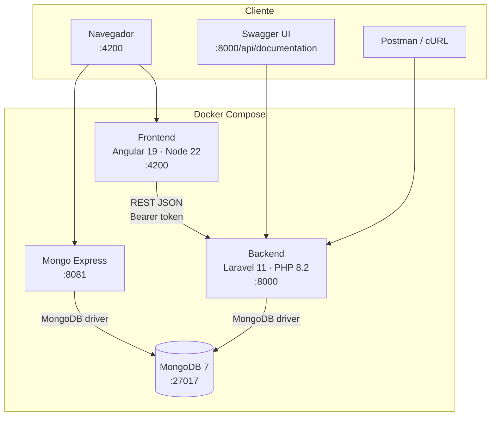
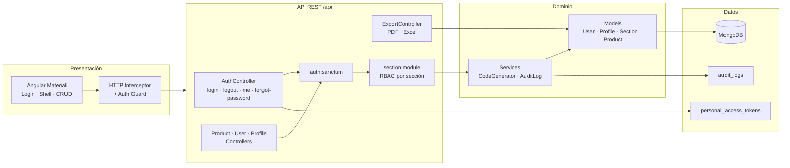
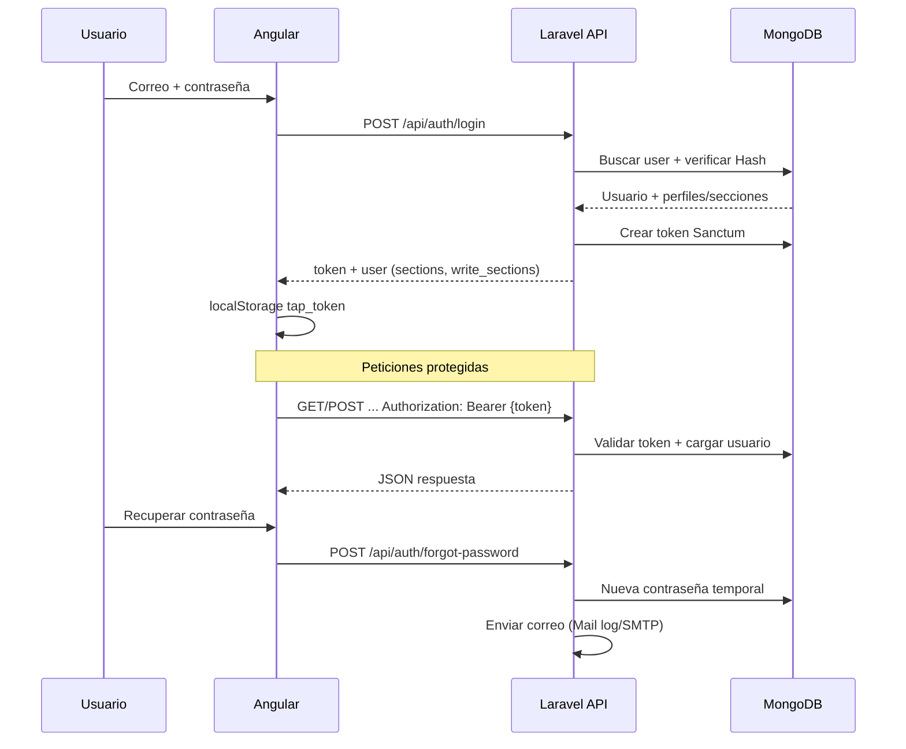
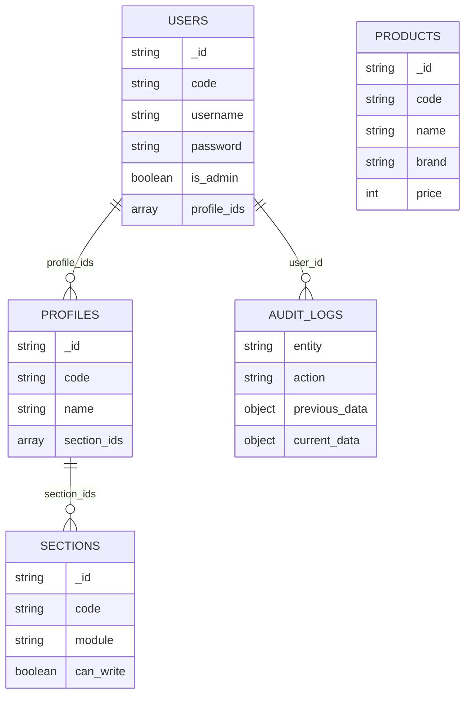
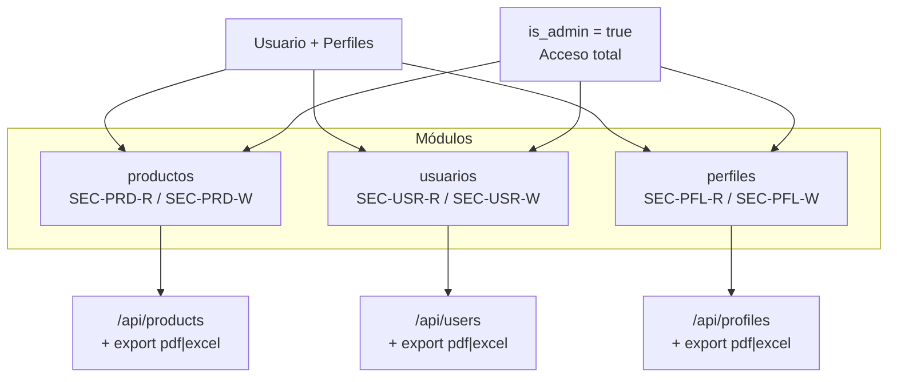

# Arquitectura — Tap Terminal

Documentación de la arquitectura del sistema full stack del examen de admisión (Área de Desarrollo).

## Stack tecnológico

| Capa | Tecnología |
|------|------------|
| Frontend | Angular 19, TypeScript, Angular Material |
| API | Laravel 11, PHP 8.2 |
| Autenticación | Laravel Sanctum (Bearer token) |
| Base de datos | MongoDB 7 |
| Exportaciones | DomPDF (PDF), Maatwebsite Excel |
| Contenedores | Docker Compose (frontend, backend, mongodb) |

---

## Vista de despliegue



### Puertos

| Componente | Puerto | Rol |
|------------|--------|-----|
| Angular (frontend) | 4200 | SPA, UI, guards, interceptor Bearer |
| Laravel (backend) | 8000 | API REST, Sanctum, RBAC, exportaciones |
| MongoDB (Docker) | **27018** en el host (27017 en la red Docker) | Persistencia en documentos |
| Mongo Express | 8081 | UI web para explorar la base de datos |
| Swagger | 8000 | Documentación y pruebas de API |

---

## Vista lógica por capas



---

## Flujo de autenticación (Sanctum)



---

## Modelo de datos (MongoDB)



### Colecciones principales

| Colección | Contenido |
|-----------|-----------|
| `users` | Usuarios, credenciales, perfiles asignados |
| `profiles` | Roles y permisos por sección |
| `sections` | Módulos (`productos`, `usuarios`, `perfiles`) y lectura/escritura |
| `products` | Catálogo de productos |
| `personal_access_tokens` | Tokens Sanctum |
| `audit_logs` | Bitácora create/update/delete |
| `counters` | Secuencias para códigos automáticos (PRD, USR, PFL) |

---

## Módulos funcionales y permisos (RBAC)



El middleware `section` valida que el usuario tenga acceso al módulo solicitado. Las rutas con sufijo `,write` exigen sección con `can_write: true` (o ser administrador).

---

## Estructura del repositorio

```
Examen Tap Terminal/
├── frontend/                 # Angular 19
│   └── src/app/
│       ├── auth/             # Login, recuperar contraseña
│       ├── core/             # AuthService, interceptor, guards, API
│       ├── layout/           # Shell (sidebar + topbar)
│       ├── products/
│       ├── users/
│       └── profiles/
├── backend/                  # Laravel 11 API
│   ├── app/
│   │   ├── Http/Controllers/Api/
│   │   ├── Http/Middleware/  # CheckSectionAccess
│   │   ├── Models/
│   │   └── Services/         # AuditLog, CodeGenerator
│   ├── database/seeders/
│   └── routes/api.php
├── docker-compose.yml
├── postman/
└── README.md
```

---

## Endpoints principales

| Método | Ruta | Auth | Descripción |
|--------|------|------|-------------|
| POST | `/api/auth/login` | No | Iniciar sesión |
| POST | `/api/auth/forgot-password` | No | Recuperar contraseña |
| POST | `/api/auth/logout` | Sí | Cerrar sesión |
| GET | `/api/auth/me` | Sí | Usuario actual |
| GET/POST/PUT/DELETE | `/api/products` | Sí + sección | CRUD productos |
| GET/POST/PUT/DELETE | `/api/users` | Sí + sección | CRUD usuarios |
| GET/POST/PUT/DELETE | `/api/profiles` | Sí + sección | CRUD perfiles |
| GET | `/api/*-export/{pdf\|excel}` | Sí + sección | Exportaciones |

---

## Diagrama ASCII (resumen)

```
┌─────────────────────────────────────────────────────────┐
│  Angular 19 + Material + TypeScript                     │
│  · AuthService / Guards / Interceptor                   │
│  · Módulos: Productos, Usuarios, Perfiles               │
└──────────────────────────┬──────────────────────────────┘
                           │ HTTP JSON (Bearer)
┌──────────────────────────▼──────────────────────────────┐
│  Laravel 11 API                                         │
│  · Sanctum (Bearer)                                     │
│  · Middleware section (RBAC)                            │
│  · DomPDF + Maatwebsite Excel                           │
│  · Bitácora audit_logs                                  │
└──────────────────────────┬──────────────────────────────┘
                           │
┌──────────────────────────▼──────────────────────────────┐
│  MongoDB (users, products, profiles, sections, …)     │
└─────────────────────────────────────────────────────────┘
```
