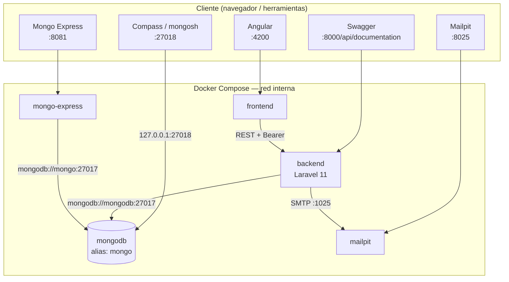
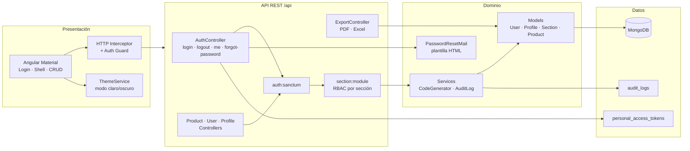
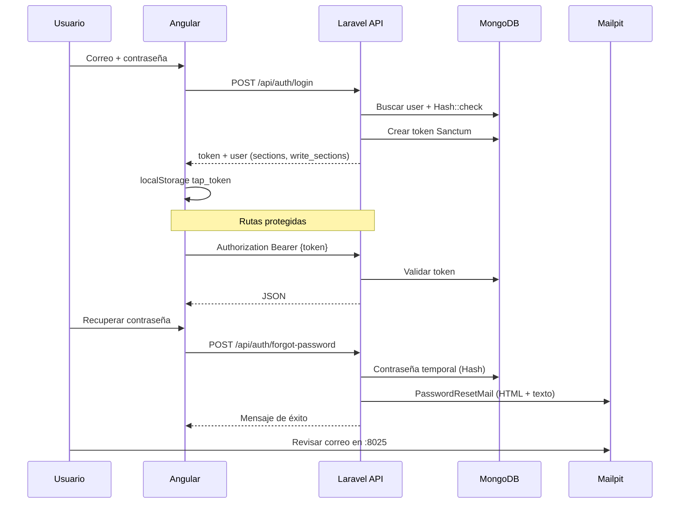
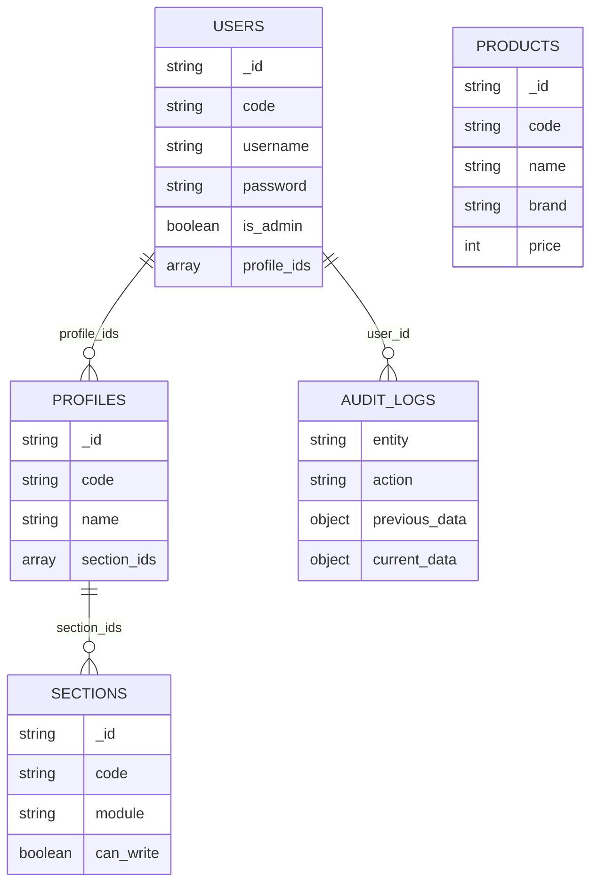
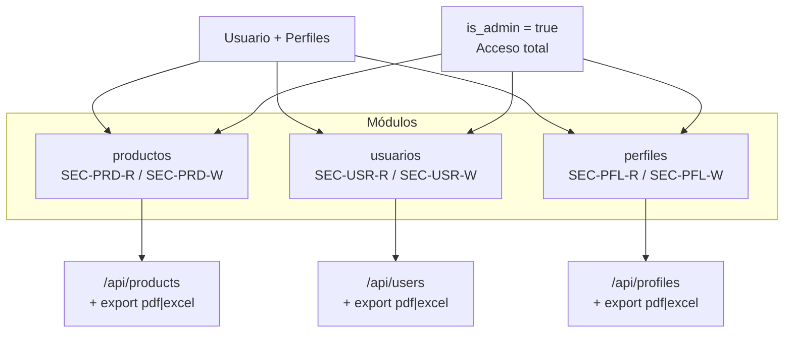

# Arquitectura — Tap Terminal

Documentación de la arquitectura del sistema full stack del examen de admisión (Área de Desarrollo).

## Stack tecnológico

| Capa | Tecnología |
|------|------------|
| Frontend | Angular 19, TypeScript, Angular Material |
| API | Laravel 11, PHP 8.2 |
| Autenticación | Laravel Sanctum (Bearer token) |
| Base de datos | MongoDB 7 |
| Correo (desarrollo) | Mailpit (SMTP + UI web) |
| Explorador DB (desarrollo) | Mongo Express |
| Exportaciones | DomPDF (PDF), Maatwebsite Excel |
| Contenedores | Docker Compose |

---

## Servicios Docker Compose

| Servicio | Imagen | Puerto(s) host | Función |
|----------|--------|------------------|---------|
| `frontend` | node:22 | 4200 | SPA Angular |
| `backend` | build `./backend` | 8000 | API Laravel + Swagger |
| `mongodb` | mongo:7 | **27018** → 27017 | Base de datos del proyecto |
| `mongo-express` | mongo-express | 8081 | UI web de MongoDB |
| `mailpit` | axllent/mailpit | 8025 (UI), 1025 (SMTP) | Correos de desarrollo |

Volumen persistente: `mongodb_data` (datos de MongoDB).

---

## Vista de despliegue



### Puertos y URLs

| Componente | URL / conexión | Rol |
|------------|----------------|-----|
| Frontend | http://localhost:4200 | Panel de administración |
| API + Swagger | http://localhost:8000 · http://localhost:8000/api/documentation | REST y documentación |
| MongoDB (desde el PC) | `mongodb://127.0.0.1:27018/tapterminal` | Compass, scripts locales |
| MongoDB (desde contenedores) | `mongodb://mongodb:27017` o `mongodb://mongo:27017` | Backend, Mongo Express |
| Mongo Express | http://localhost:8081 — `admin` / `tapterminal` | Explorar colecciones en el navegador |
| Mailpit | http://localhost:8025 | Ver correos de recuperar contraseña |

> **Puerto 27018:** Mongo de Docker se publica en **27018** en el host para no chocar con MongoDB instalado en Windows, que suele usar **27017** en `127.0.0.1`.

---

## Acceso a MongoDB (Docker vs local)

En muchos equipos coexisten dos instancias:

| Instancia | Cómo detectarla | Conexión desde Compass |
|-----------|-----------------|------------------------|
| MongoDB de **Windows** | Servicio `mongod.exe`, puerto `127.0.0.1:27017` | `mongodb://127.0.0.1:27017` — **no** es la del proyecto |
| MongoDB de **Docker** | `docker compose ps mongodb` | `mongodb://127.0.0.1:27018/tapterminal` |

**Mongo Express** siempre usa la red Docker (`mongo:27017`), por eso en http://localhost:8081/db/tapterminal ves los datos correctos aunque Compass en 27017 muestre otra cosa.

Base de datos del proyecto: **`tapterminal`**.

---

## Vista lógica por capas



---

## Flujo de autenticación (Sanctum)



### Recuperación de contraseña

1. Genera contraseña temporal (`Str::password`).
2. La guarda cifrada en `users`.
3. Envía `PasswordResetMail` (vista `emails/password-reset.blade.php`).
4. En Docker el SMTP apunta a **mailpit** (`MAIL_HOST=mailpit`, puerto `1025`).

Tras usar recuperar contraseña, el seed deja de coincidir con la clave anterior; restaurar con `php artisan db:seed` o leer la clave en Mailpit.

---

## Modelo de datos (MongoDB)



### Colecciones principales

| Colección | Contenido |
|-----------|-----------|
| `users` | Usuarios, credenciales, perfiles asignados |
| `profiles` | Roles y permisos por sección |
| `sections` | Módulos (`productos`, `usuarios`, `perfiles`) y lectura/escritura |
| `products` | Catálogo de productos |
| `personal_access_tokens` | Tokens Sanctum (MongoDB `_id` como string) |
| `audit_logs` | Bitácora create / update / delete |
| `counters` | Secuencias para códigos automáticos (PRD, USR, PFL) |

---

## Módulos funcionales y permisos (RBAC)



El middleware `section` valida acceso al módulo. Las rutas con sufijo `,write` exigen sección con `can_write: true` o ser administrador.

---

## Estructura del repositorio

```
Examen Tap Terminal/
├── frontend/                      # Angular 19
│   └── src/app/
│       ├── auth/                  # Login, recuperar contraseña
│       ├── core/                  # AuthService, interceptor, guards, theme
│       ├── layout/                # Shell (sidebar + topbar)
│       ├── products/
│       ├── users/
│       └── profiles/
├── backend/                       # Laravel 11 API
│   ├── app/
│   │   ├── Http/Controllers/Api/
│   │   ├── Http/Middleware/       # CheckSectionAccess
│   │   ├── Mail/                  # PasswordResetMail
│   │   ├── Models/
│   │   └── Services/              # AuditLog, CodeGenerator
│   ├── config/mail.php
│   ├── resources/views/emails/    # password-reset (HTML + texto)
│   ├── database/seeders/
│   └── routes/api.php
├── docker-compose.yml             # mongodb, mongo-express, mailpit, backend, frontend
├── ARCHITECTURE.md                # Este documento
├── postman/
└── README.md
```

---

## Endpoints principales

| Método | Ruta | Auth | Descripción |
|--------|------|------|-------------|
| POST | `/api/auth/login` | No | Iniciar sesión |
| POST | `/api/auth/forgot-password` | No | Recuperar contraseña (correo HTML) |
| POST | `/api/auth/logout` | Sí | Cerrar sesión |
| GET | `/api/auth/me` | Sí | Usuario actual |
| GET | `/api/sections` | Sí | Listar secciones |
| GET/POST/PUT/DELETE | `/api/products` | Sí + sección | CRUD productos |
| GET/POST/PUT/DELETE | `/api/users` | Sí + sección | CRUD usuarios |
| GET/POST/PUT/DELETE | `/api/profiles` | Sí + sección | CRUD perfiles |
| GET | `/api/*-export/{pdf\|excel}` | Sí + sección | Exportaciones |

---

## Variables de entorno relevantes (backend)

| Variable | Docker Compose | Uso |
|----------|------------------|-----|
| `MONGODB_URI` | `mongodb://mongodb:27017` | Conexión desde el contenedor backend |
| `MONGODB_DATABASE` | `tapterminal` | Nombre de la base |
| `FRONTEND_URL` | `http://localhost:4200` | Enlace en correo de recuperación |
| `MAIL_MAILER` | `smtp` | Envío real a Mailpit |
| `MAIL_HOST` | `mailpit` | Host SMTP en red Docker |
| `MAIL_PORT` | `1025` | Puerto SMTP Mailpit |

Desde el host (Compass, `php artisan` local): `MONGODB_URI=mongodb://127.0.0.1:27018`.

---

## Diagrama ASCII (resumen)

```
┌──────────────────────────────────────────────────────────┐
│  Angular 19 · :4200                                      │
│  Auth · RBAC en UI · Productos / Usuarios / Perfiles     │
└───────────────────────────┬──────────────────────────────┘
                            │ HTTP JSON (Bearer)
┌───────────────────────────▼──────────────────────────────┐
│  Laravel 11 · :8000                                        │
│  Sanctum · middleware section · PDF/Excel · audit_logs     │
│  Correo recuperación → Mailpit :8025                       │
└───────────────┬──────────────────────────┬─────────────────┘
                │                          │
                ▼                          ▼
┌───────────────────────────┐   ┌──────────────────────────┐
│  MongoDB (tapterminal)     │   │  Mailpit (SMTP :1025)    │
│  Host :27018 · Docker :27017│   │  UI :8025                │
│  Mongo Express :8081       │   └──────────────────────────┘
└───────────────────────────┘
```

---

## Referencias

- Instalación y credenciales de prueba: [README.md](./README.md)
- Colección Postman: `postman/TapTerminal.postman_collection.json`
