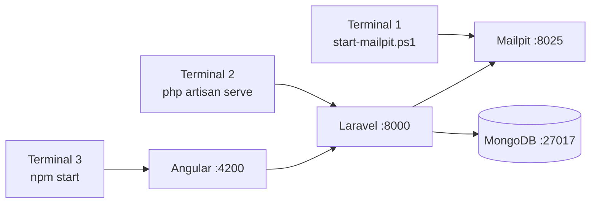
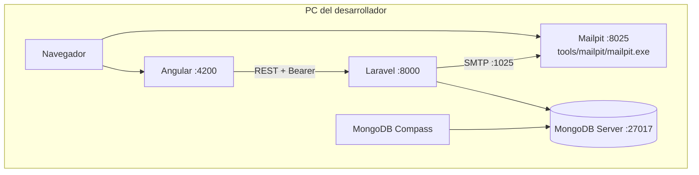
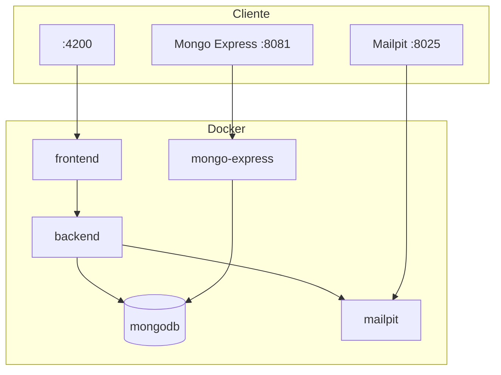
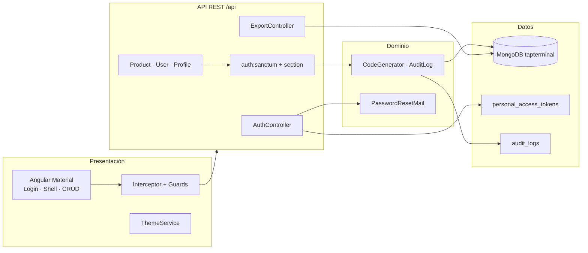
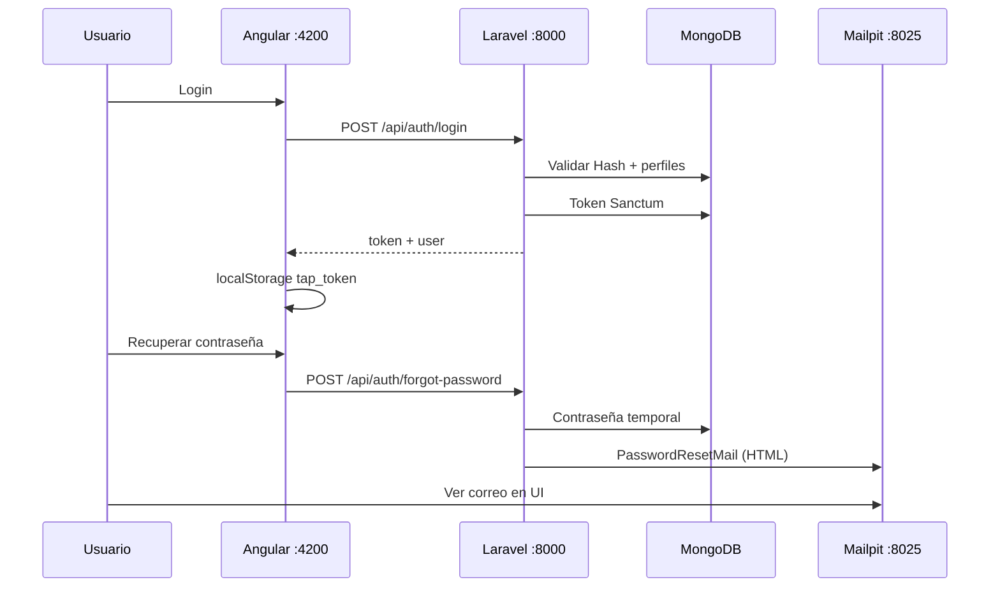
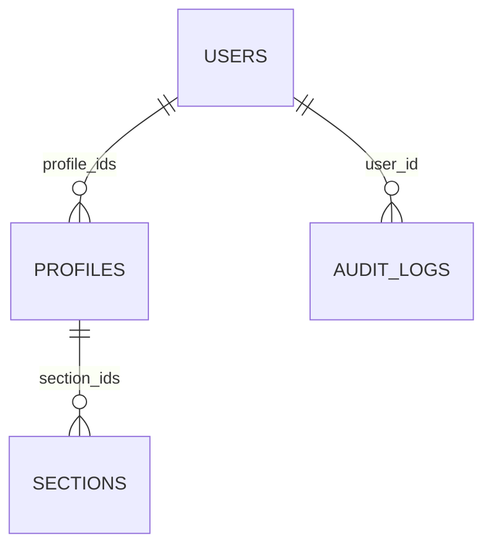

# Arquitectura — Tap Terminal

Documentación de la arquitectura del sistema full stack del examen de admisión (Área de Desarrollo).

---

## Modos de ejecución

| Modo | Cuándo usar | MongoDB | Correo |
|------|-------------|---------|--------|
| **Local** (recomendado) | Desarrollo diario en Windows | `127.0.0.1:27017` | Mailpit nativo → `127.0.0.1:1025` |
| **Docker** (opcional) | Entorno aislado / equipo sin PHP local | Host `:27018` → contenedor | SMTP → `mailpit:1025` |

---

## Stack tecnológico

| Capa | Tecnología |
|------|------------|
| Frontend | Angular 19, TypeScript, Angular Material |
| API | Laravel 11, PHP 8.2 |
| Autenticación | Laravel Sanctum (Bearer token) |
| Base de datos | MongoDB 7 |
| Correo (desarrollo) | Mailpit (binario o Docker) + `PasswordResetMail` (HTML) |
| Explorador DB (Docker) | Mongo Express |
| Exportaciones | DomPDF (PDF), Maatwebsite Excel |

---

## Arranque local (3 procesos)



| Paso | Comando | URL |
|------|---------|-----|
| 1 | `.\scripts\start-mailpit.ps1` | http://localhost:8025 |
| 2 | `cd backend` → `php artisan serve` | http://localhost:8000 |
| 3 | `cd frontend` → `npm start` | http://localhost:4200 |

---

## Vista de despliegue — local



### Puertos (local)

| Componente | URL / conexión |
|------------|----------------|
| Frontend | http://localhost:4200 |
| API + Swagger | http://localhost:8000 · `/api/documentation` |
| Mailpit | http://localhost:8025 · `.\scripts\start-mailpit.ps1` |
| MongoDB | `mongodb://127.0.0.1:27017/tapterminal` |

---

## Vista de despliegue — Docker (opcional)



| Componente | Host |
|------------|------|
| MongoDB (contenedor) | `127.0.0.1:27018` (evita conflicto con Mongo local en 27017) |
| Mongo Express | http://localhost:8081 — `admin` / `tapterminal` |
| Mailpit | http://localhost:8025 |

---

## Vista lógica por capas



---

## Flujo de autenticación



---

## Recuperación de contraseña

1. Angular → `POST /api/auth/forgot-password` con `username` (email).
2. Laravel genera contraseña temporal y actualiza `users.password` (Hash).
3. Envía `App\Mail\PasswordResetMail` (vistas `emails/password-reset*.blade.php`).
4. Mailpit recibe SMTP en `127.0.0.1:1025`; UI en http://localhost:8025.

---

## Modelo de datos (MongoDB)

Base: **`tapterminal`**

| Colección | Contenido |
|-----------|-----------|
| `users` | Usuarios, credenciales, `profile_ids`, `is_admin` |
| `profiles` | Roles y `section_ids` |
| `sections` | Módulos (`productos`, `usuarios`, `perfiles`), `can_write` |
| `products` | Catálogo (código PRD, precio 0–999) |
| `personal_access_tokens` | Tokens Sanctum (`_id` string) |
| `audit_logs` | Bitácora create / update / delete |
| `counters` | Secuencias PRD / USR / PFL |



---

## RBAC por secciones

Módulos: `productos`, `usuarios`, `perfiles`.

- Middleware `section:{modulo}` — lectura.
- Middleware `section:{modulo},write` — alta/edición/baja.
- `is_admin = true` — acceso total.

---

## Estructura del repositorio

```
Examen Tap Terminal/
├── frontend/src/app/
│   ├── auth/              # login, recuperar contraseña
│   ├── core/              # AuthService, interceptor, theme
│   ├── layout/            # shell
│   ├── products|users|profiles/
├── backend/
│   ├── app/Mail/PasswordResetMail.php
│   ├── app/Services/      # AuditLog, CodeGenerator
│   ├── resources/views/emails/
│   ├── config/mail.php
│   ├── .env.example
│   └── .env.docker.example
├── scripts/
│   ├── setup-windows.ps1
│   ├── start-mailpit.ps1  # Mailpit sin Docker
│   └── start-local.ps1
├── tools/mailpit/         # binario (gitignored)
├── docker-compose.yml
├── ARCHITECTURE.md
└── README.md
```

---

## Endpoints principales

| Método | Ruta | Auth |
|--------|------|------|
| POST | `/api/auth/login` | No |
| POST | `/api/auth/forgot-password` | No |
| POST | `/api/auth/logout` | Sí |
| GET | `/api/auth/me` | Sí |
| GET | `/api/sections` | Sí |
| CRUD | `/api/products`, `/users`, `/profiles` | Sí + sección |
| GET | `/api/*-export/{pdf\|excel}` | Sí + sección |

---

## Variables de entorno

### Local (`backend/.env`)

```env
MONGODB_URI=mongodb://127.0.0.1:27017
MONGODB_DATABASE=tapterminal
MAIL_MAILER=smtp
MAIL_HOST=127.0.0.1
MAIL_PORT=1025
FRONTEND_URL=http://localhost:4200
```

### Docker (`docker-compose.yml` → backend)

```env
MONGODB_URI=mongodb://mongodb:27017
MAIL_HOST=mailpit
MAIL_PORT=1025
```

---

## Diagrama ASCII

```
┌─────────────────────────────────────────┐
│  Angular 19          localhost:4200     │
└────────────────────┬────────────────────┘
                     │ Bearer JSON
┌────────────────────▼────────────────────┐
│  Laravel 11          localhost:8000     │
│  Sanctum · RBAC · PDF/Excel · audit     │
└─────────┬──────────────────┬────────────┘
          │ SMTP :1025       │
          ▼                  ▼
┌─────────────────┐  ┌──────────────────────┐
│ Mailpit :8025   │  │ MongoDB :27017       │
│ (sin Docker)    │  │ DB: tapterminal      │
└─────────────────┘  └──────────────────────┘
```

---

## Referencias

- Instalación y arranque: [README.md](./README.md)
- Postman: `postman/TapTerminal.postman_collection.json`
- Mailpit: https://mailpit.axllent.org/docs/install/
